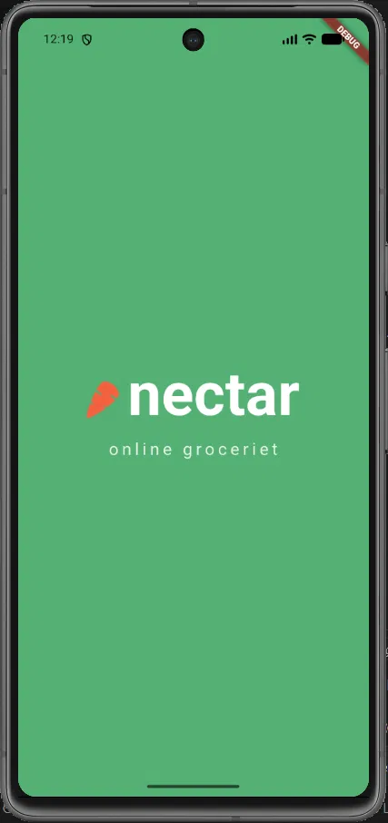
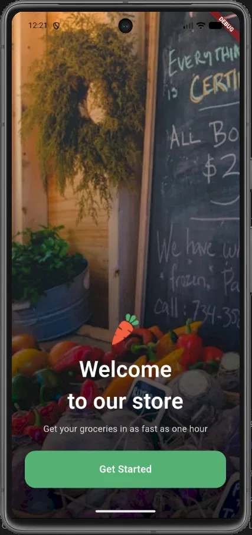
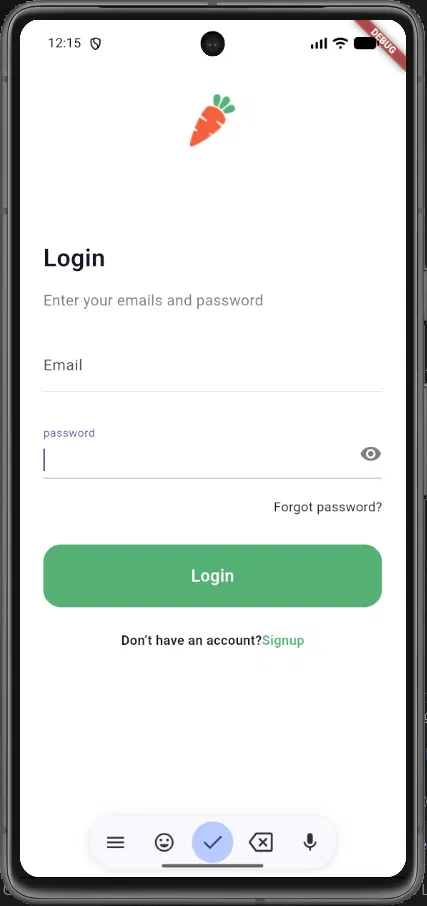
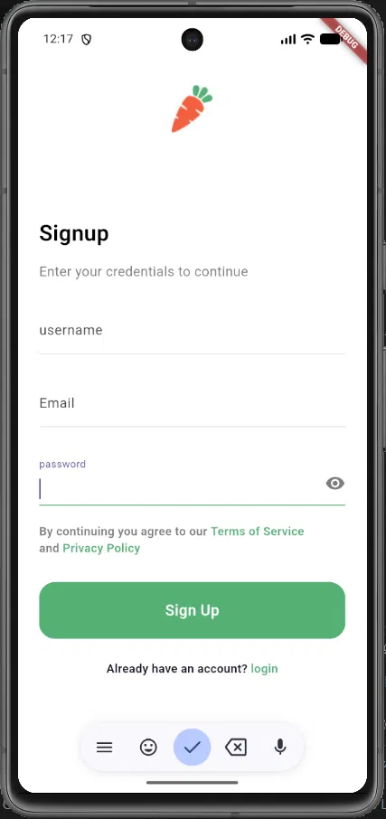
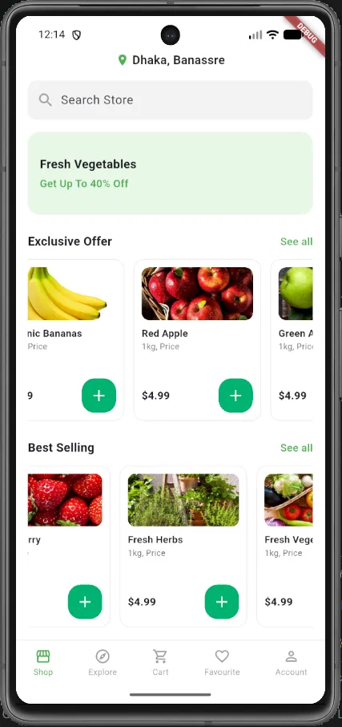
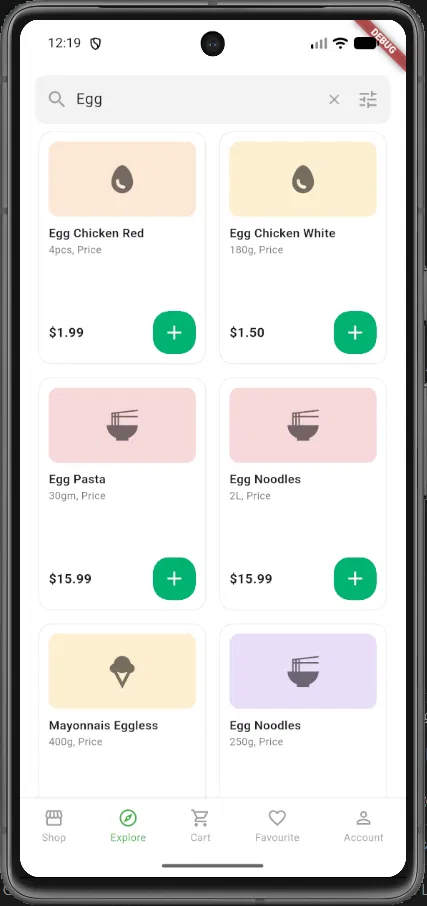

# 🛒 Groceries App

A modern and user-friendly groceries shopping mobile application UI built with Flutter.

## 📱 About The Project

Groceries App is a Flutter mobile application designed for online grocery shopping.

The application provides a clean and simple user interface where users can browse products, search for items, view favorites, manage their cart, and access their account.

This project focuses mainly on building the application's UI and implementing navigation between screens.

## ✨ Features

- 🏠 Home Screen
- 🔍 Search Screen
- 🛒 Shopping Cart
- ❤️ Favorites
- 👤 Account Screen
- 🔐 Login & Signup UI
- 🚀 Onboarding Screen
- 🛍️ Product Cards
- ➕ Add to Cart Buttons
- 🔎 Search Bar
- 📱 Bottom Navigation Bar
- ↔️ Horizontal product scrolling
- 🖼️ Product images using Flutter Assets
- 🎨 Clean and responsive UI

## 🛠️ Technologies Used

- Flutter
- Dart
- Material Design
- VS Code
- Android Emulator
- Git & GitHub

## 📱 Screenshots

### Splash Screen


### Onboarding Screen


### Login Screen


### Signup Screen


### Home Screen


### Search Screen



## 📂 Project Structure

```text
lib/
├── components/
│   ├── actionbutton.dart
│   └── addbutton.dart
│
├── screens/
│   ├── home_screen.dart
│   ├── search_screen.dart
│   ├── account_screen.dart
│   └── ...
│
└── main.dart

assets/
└── product images


